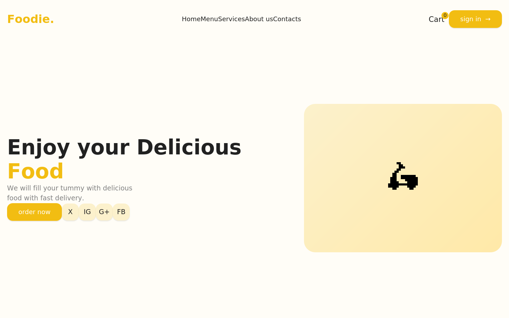

# Foodie Website 🍔

A responsive front-end food delivery website built with HTML, CSS, and vanilla JavaScript.



## Features

- 📱 Fully responsive design (desktop + mobile with hamburger menu)
- 🍽️ Dynamic menu cards rendered from `products.json`
- 🛒 Add-to-cart functionality with live quantity and total updates
- ⭐ Customer review carousel (Swiper.js)
- 🎨 Clean, modern UI with a custom color palette

## Tech Stack

- HTML5
- CSS3 (custom properties, Flexbox)
- JavaScript (ES6, Fetch API)
- [Swiper.js](https://swiperjs.com/) for the reviews carousel
- [Font Awesome](https://fontawesome.com/) for icons

## Project Structure

```
Foodie-Website/
├── images/          # Product and UI images
├── index.html       # Main page markup
├── Style.css         # All styling
├── main.js          # Cart logic, menu rendering, carousel init
├── products.json    # Menu item data
└── README.md
```

## Getting Started

1. Clone the repo
   ```bash
   git clone https://github.com/jyotirmayeedhal/Foodie-Website.git
   ```
2. Open `index.html` in your browser — no build step or server required.

## Author

**Jyotirmayee Dhal**
[GitHub](https://github.com/jyotirmayeedhal)
